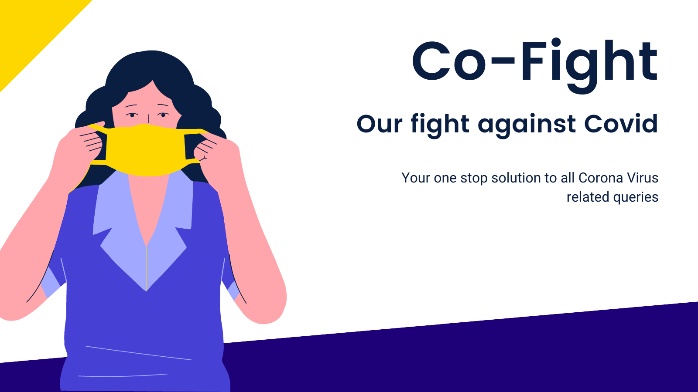
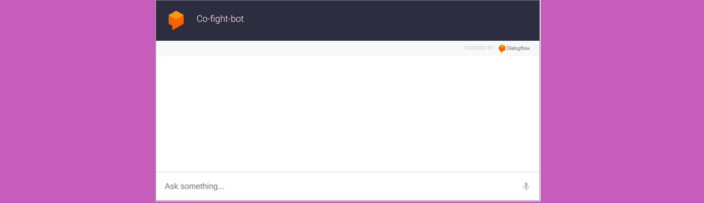
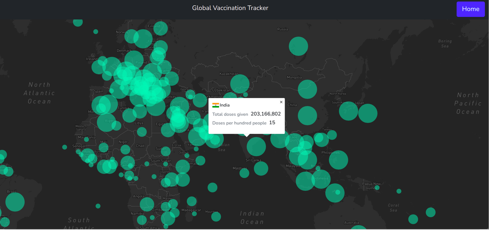

  <h1 ><a href="https://cofighthackon.netlify.app/">Co-Fight</a></h1>
  <b>
    Our battle against Corona Virus
  </b>
  

Covid-19 has been affecting us since the last one and a half years. We thought it would be a good idea to come up with a web app which would provide all your requirements regarding covid in one place. Our Co-Fight app contains links to all the important portals like CoWin, Who and MoHFW. It also contains a visualisation of vaccinations , a Covid Tracker, a Vaccination visualization. It also contains a self assessment page where you can check about your risk of Covid infection.  

## Our chosen theme 👉 

## Our Demo  (click on image ) 👉

## Glimpses 👉

### Co-Fight Chatbot 

### Co-Fight Tracker

### Vaccination Tracker

### Co-Fight Self Assesment

## Idea 👉
Corona Virus has affected our lives really bad. During this time while we sit at our home we thought to make a collection of all important sites which will guide evryone in fighting Covid-19 and will also make our lives easier. Co-fight tries to fulfil that need.

## Features 👉
1. Link to important Covid-related sites like WHO, MOHFW, CoWin
2. A Covid traker application to give you idea of the number of cases and recoveries daily.
3. A Vaccination visualization which will give you an idea about the number of vaccine doses being administered.

## Tech Stack used
HTML, CSS, Javascript, React, Material UI

## Challenges
1. Building app in 2 days.
2. Collaborating with members virtually.
3. Making the tracker apps using React
4. Implementing design using Material UI

## Further prospects 
1. We plan on improving the app's functionalities and design
2. We plan on providing a user interface for signing in and implement user authentication.
2. We can also maintain medical logs of students.

## View our Deployment here 👉
https://cofighthackon.netlify.app/
